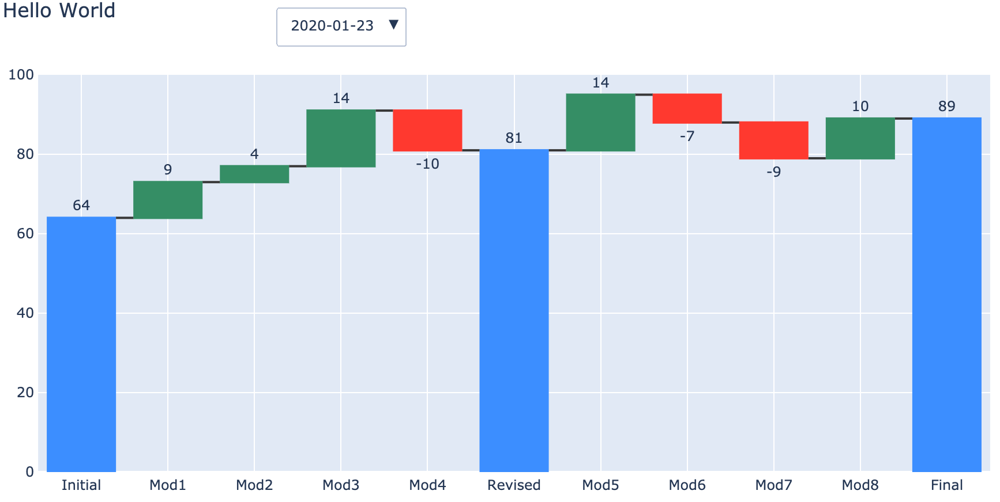
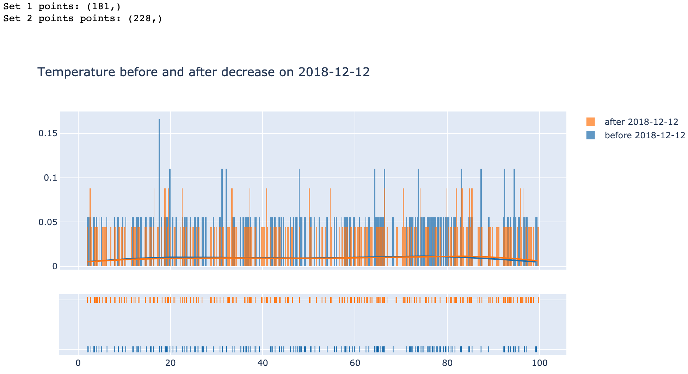

# plotly_toolkit
Repository for various plotting functions using plotly.

## Waterfall Plot
[Waterfall notebook](./notebooks/dyn_waterfall_viz.ipynb)
* Allows for visualisation of data using a waterfall plot.
* Dropdown selector allows for data split by timestamps to be displayed dynamically.


## Distribution Plot (Dist Plot)
[Dist plot notebook](./notebooks/distplots.ipynb)
* Allows for visualisation of data using a distribution plot.
* Automatically creates dateranges around given dates


## Usage
All notebooks rely on plotting_tools.py
```
from plotting_tools.py import foo, bar
```
### Dependencies
* Plotly
* Numpy
* Pandas